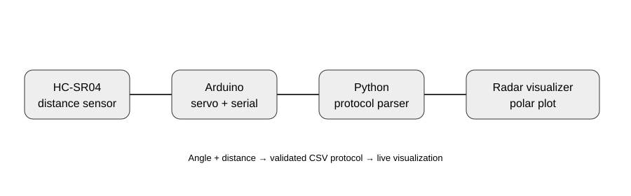

# Arduino Radar 📡

A small embedded-systems project that combines an ultrasonic distance sensor, a servo sweep, serial communication, and a Python polar visualizer.

## 🎯 Goal

Measure an object's distance at different servo angles and stream the measurements to a computer using a simple, testable CSV-like protocol:

```text
angle,distance_cm
```

## 🧩 Architecture



## 🔧 Hardware

- Arduino Uno (or compatible board)
- HC-SR04 ultrasonic sensor
- SG90/MG90S-compatible servo
- USB serial connection

### Wiring

| Component | Arduino |
|---|---|
| HC-SR04 VCC | 5V |
| HC-SR04 GND | GND |
| HC-SR04 TRIG | D10 |
| HC-SR04 ECHO | D11 |
| Servo signal | D9 |

Use a suitable power arrangement for the servo and keep grounds common.

## 💻 Software

- Arduino sketch: `radar.ino`
- Python visualizer: `visualizer_refactored.py`
- Serial parser: `radar_utils.py`
- Automated protocol tests: `tests/test_protocol.py`

## 🚀 Run the visualizer

Install Python dependencies:

```bash
pip install -r requirements.txt
```

Then pass the Arduino serial port:

```bash
python visualizer_refactored.py COM3
```

On another machine, replace `COM3` with the correct serial port.

## 🧪 Tests

The parser is deliberately separated from the serial/GUI layer so it can be tested without hardware:

```bash
pytest
```

The tests cover valid packets, malformed input, angle boundaries and maximum-distance filtering.

For physical calibration, use the checklist in `tests/hardware_test.md` and record measured distances instead of claiming an accuracy that has not been experimentally verified.

## 📁 Structure

```text
arduino-radar/
├── docs/
│   └── architecture.svg
├── tests/
│   ├── hardware_test.md
│   └── test_protocol.py
├── radar.ino
├── radar_utils.py
├── visualizer.py
├── visualizer_refactored.py
└── requirements.txt
```

## 🔮 Future Improvements

- Add persistent radar history/trails
- Add distance calibration
- Add a configurable scan range and step size
- Add obstacle alerts
- Add a cleaner desktop UI
