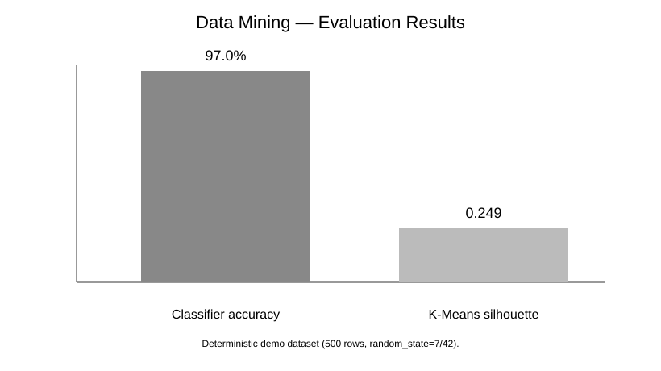

# Data Mining 📊

A reproducible data-mining workflow that combines **data preparation, feature scaling, unsupervised clustering, and supervised classification** on a locally generated tabular dataset.

## ✨ What this project demonstrates

- Deterministic synthetic dataset generation
- Missing-value cleanup
- Standardization with `StandardScaler`
- Customer-style segmentation with K-Means
- Classification with Random Forest
- Silhouette-score and accuracy evaluation
- Automated tests for the core pipeline

## 🔄 Workflow

```text
Raw tabular data
      ↓
Cleaning / validation
      ↓
Feature scaling
   ↙       ↘
K-Means    Random Forest
   ↓          ↓
Clusters   Classification
   ↘       ↙
   Evaluation
```

## 📊 Current benchmark



With the deterministic 500-row demo dataset, the current implementation produced:

| Metric | Result |
|---|---:|
| Random Forest test accuracy | 97.0% |
| K-Means silhouette score | 0.249 |
| Number of clusters | 3 |

The results are **specific to the generated demo data** and should not be interpreted as production performance.

## 📁 Structure

```text
data-mining/
├── docs/
│   └── results.svg
├── tests/
│   └── test_pipeline.py
├── main.py
├── requirements.txt
└── pytest.ini
```

## 🚀 Run locally

```bash
python -m venv .venv
# Windows
.venv\Scripts\activate
# macOS/Linux
# source .venv/bin/activate

pip install -r requirements.txt
python main.py
```

Run tests:

```bash
pytest
```

## 🧪 Why both clustering and classification?

K-Means answers an **unsupervised** question: “Which observations naturally group together?” Random Forest answers a **supervised** question: “Can known target labels be predicted from the features?” Keeping both in one project makes the difference between the two learning settings concrete.

## 🔮 Future Improvements

- Add PCA and 2D cluster visualization
- Compare several values of `k` using an elbow curve
- Add confusion matrix and precision/recall/F1
- Separate data generation, preprocessing, modeling and reporting into modules
- Support loading a real CSV dataset
