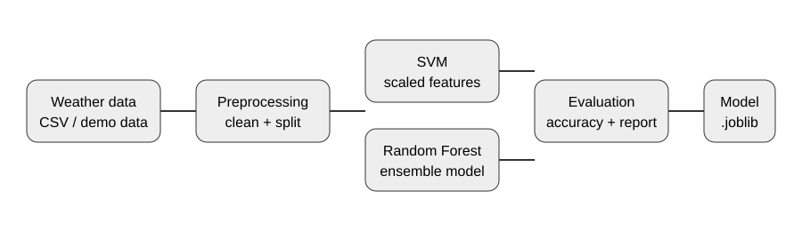
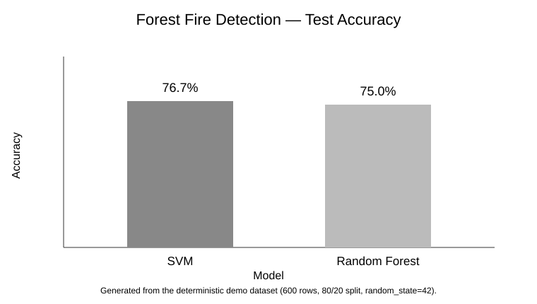

# Forest Fire Detection 🔥

A reproducible machine-learning project for classifying **forest-fire risk** from environmental measurements. The project demonstrates a complete small ML workflow: data generation/loading, cleaning, stratified train/test splitting, model comparison, evaluation, and model persistence.

> **Educational project:** this model is not a certified fire-detection or safety system and must not be used for real emergency decisions.

## ✨ Highlights

- Deterministic demo dataset generation for reproducible experiments
- Input validation through automated tests
- Stratified train/test split
- Comparison of **SVM** and **Random Forest**
- Accuracy and classification report
- Best-model persistence with Joblib
- Architecture diagram and recorded benchmark result

## 🧠 Pipeline



1. Load `data/fire_risk.csv`, or generate a deterministic demo dataset.
2. Remove rows containing missing values.
3. Select temperature, humidity, wind and rain as features.
4. Split data into training and test sets with stratification.
5. Train SVM with standardization and Random Forest.
6. Compare test accuracy.
7. Save the best estimator to `models/fire_risk_model.joblib`.

## 📊 Benchmark



Using the built-in deterministic demo dataset (600 rows, 80/20 stratified split, `random_state=42`), the current run produced:

| Model | Test accuracy |
|---|---:|
| SVM | 76.7% |
| Random Forest | 75.0% |

These numbers describe the generated demo dataset only; they are **not** a claim of real-world fire prediction accuracy.

## 📁 Structure

```text
forest-fire-detection/
├── data/
├── docs/
│   ├── architecture.svg
│   └── results.svg
├── models/
├── tests/
│   └── test_training.py
├── train.py
├── requirements.txt
└── pytest.ini
```

## 🚀 Quick Start

```bash
python -m venv .venv
# Windows
.venv\Scripts\activate
# macOS/Linux
# source .venv/bin/activate

pip install -r requirements.txt
python train.py
```

Run the automated tests:

```bash
pytest
```

## 🔬 Reproducibility

The demo data and model training use fixed random seeds. If you replace the CSV with your own dataset, document the dataset source, feature definitions, class balance, and experiment configuration before comparing results.

## 🔮 Future Improvements

- Add precision, recall, F1 and confusion-matrix visualizations
- Add cross-validation and hyperparameter search
- Add feature-importance analysis
- Add a small Tkinter inference UI
- Evaluate on a properly sourced real-world dataset
