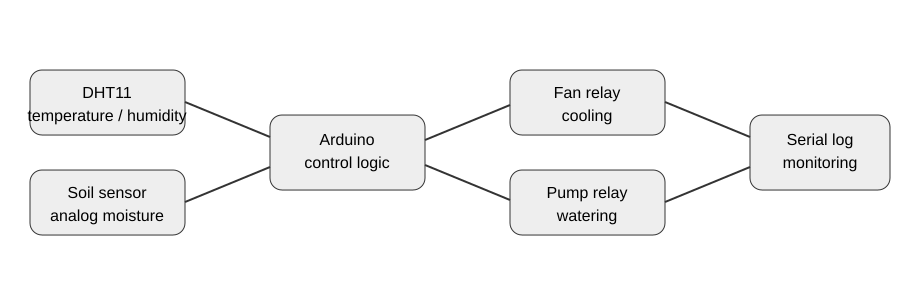

# Smart Greenhouse 🌱

An Arduino-based greenhouse automation prototype that reads **temperature, humidity, and soil moisture** and switches a fan and water pump through relay outputs.

## 🎯 Objective

Turn basic environmental measurements into simple deterministic control decisions that can be observed through the Serial Monitor.

## 🧩 Architecture



## 🔧 Hardware

- Arduino Uno
- DHT11 temperature/humidity sensor
- Analog soil-moisture sensor
- 2-channel relay module (or equivalent)
- Fan
- Water pump

## 🔌 Pin map

| Component | Pin |
|---|---|
| DHT11 data | D2 |
| Soil sensor | A0 |
| Fan relay | D8 |
| Pump relay | D9 |

## ⚙️ Control rules

The current sketch uses explicit thresholds:

- **Temperature ≥ 30°C** → fan ON
- **Temperature < 30°C** → fan OFF
- **Soil reading ≥ 650** → pump ON
- **Soil reading < 650** → pump OFF

If the DHT11 read fails, the sketch reports an error and skips the control update for that loop.

## 🚀 Setup

1. Open `smart_greenhouse.ino` in Arduino IDE.
2. Install the **DHT sensor library** and its dependency if requested by the library manager.
3. Connect the sensors and relay module according to the pin map.
4. Select the correct Arduino board and serial port.
5. Upload the sketch.
6. Open Serial Monitor at **9600 baud**.

## 🧪 Testing

The hardware test plan is documented in `tests/logic_test.md`. It includes threshold boundary cases and sensor-failure behavior.

Because relay modules, soil sensors and pumps vary between builds, physical validation should be performed on the actual hardware before connecting a high-power load.

## 📁 Structure

```text
smart-greenhouse/
├── docs/
│   └── architecture.svg
├── tests/
│   └── logic_test.md
├── smart_greenhouse.ino
└── README.md
```

## 🔮 Future Improvements

- Add an OLED/LCD dashboard
- Add hysteresis to reduce relay chatter near thresholds
- Add ESP32 Wi-Fi monitoring
- Log environmental history
- Add manual override controls
