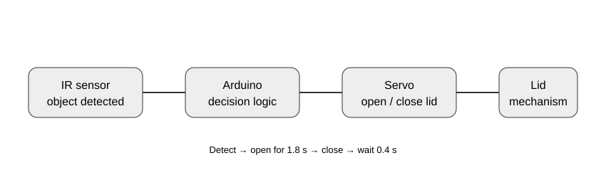

# Smart Trash Can 🗑️

A compact Arduino automation prototype that detects an object with an **IR sensor** and drives a servo to open and close a trash-can lid automatically.

## 🎯 Objective

Demonstrate a simple event-driven embedded system: sensor input → decision → actuator movement → timed reset.

## 🧩 Architecture



## 🔧 Hardware

- Arduino Uno/Nano
- IR obstacle/proximity sensor
- SG90/MG90S-compatible servo
- Mechanical lid/linkage

## 🔌 Wiring

| Component | Arduino |
|---|---|
| IR OUT | D2 |
| Servo signal | D9 |
| VCC | 5V |
| GND | GND |

## ⚙️ Behavior

The current sketch assumes an **active-low IR sensor**:

1. No detection → lid remains at 10°.
2. Detection (`LOW`) → servo moves to 95°.
3. Lid stays open for approximately 1.8 seconds.
4. Servo returns to 10°.
5. A short 0.4-second cooldown reduces immediate retriggering.

## 🧪 Testing

See `tests/hardware_test.md` for the manual test matrix. The checklist covers detection, servo positions, timing and repeated triggering.

IR sensors can react differently depending on the module and ambient lighting, so confirm the active-low assumption with the actual sensor before deployment.

## 📁 Structure

```text
smart-trash-can/
├── docs/
│   └── architecture.svg
├── tests/
│   └── hardware_test.md
├── smart_trash_can.ino
└── README.md
```

## 🔮 Future Improvements

- Replace blocking `delay()` calls with a non-blocking state machine
- Add an adjustable detection distance
- Add an ultrasonic sensor option
- Add an OLED status display
- Add an ESP32 version with usage statistics
